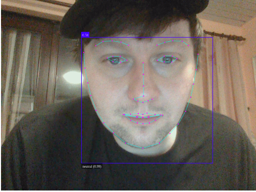

# face-tracker
Javascript FaceTracker

[Check out webcam live site here](https://josephlindzius.github.io/face-tracker/index.html)

[Check out face finder here](https://josephlindzius.github.io/face-tracker/faceIndex.html)
## About

Found this great AI/API from Github user [justadudewhohacks](https://github.com/justadudewhohacks/face-api.js/) where it is used to detect faces.  This really impressed me but what blew me away was the fact that you can do it all locally on a browser.  

Tutorial from [WebDevSimplified](https://www.youtube.com/watch?v=CVClHLwv-4I) 
    
    Please note that the way the webcam is set up in this video did not work at first.  Refer to my code if needed.  
### Known Issue

The live webcam works best loaded in good lighting and reasonable processing power it seems but it is to be expected with running such a script.

For faceIndex.html seems to have a looping problem where it is not reading all pictures before processing but rather gives back undefined.

